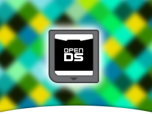
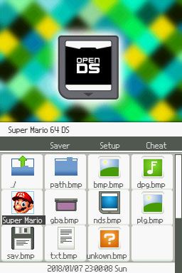
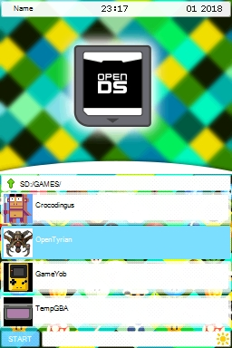

# openDS Flashcard Theme

openDS is an open source flashcard theme / skin for cartridges that enable playing homebrew on the NDS, 2DS and 3DS.

# Supported Devices

|SuperCard DSONE|SuperCard DSTWO|Wood / R4i 3DS Gold Plus|
|-|-|-|
||||

# Important Notice

I do not support or approve video game piracy in any form. If you want to play a game, buy it, to reward the developers of it and to make sure more great games are developed in future.

Video game piracy leads to **stupid, short, advertisement infested** games.

Buy games and use flashcards to play homebrew or copies you made yourself from your own games. Do not use my work with stolen games!

# Disclaimer

SuperCard, Nintendo, DSTWO, NintendoDS and all other used trademarks belong to their respective owners. I claim no rights on them. Please contact them prior using their property.

# Copyright

openDS themes for NDS flashcards are licensed under [CC-BY-4.0](https://creativecommons.org/licenses/by/4.0/).

# Used Software

Graphics made with [GIMP](https://www.gimp.org/) and [Inkscape](https://www.inkscape.org/).

# How to make your own graphics

Note down the dimensions of the graphic, you want to design. Design it with GIMP or Inkscape. Export it to PNG. Open it with GIMP and export it to a 16 Bit Windows-Bitmap with:

***File** > **Export** > **Windows-Bitmap** > **Extended Settings** > **16 Bit** > **X1 R5 G5 B5***

This leads to far better quality then the 16 bit conversions of the various skin editors.
