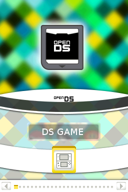
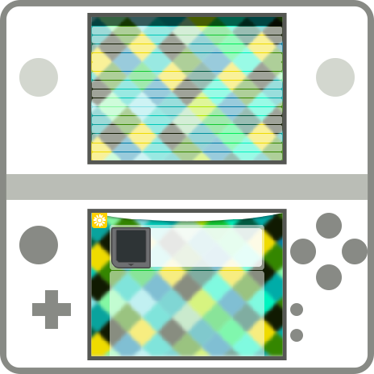

# openDS Flashcard Theme

openDS is an open source flashcard theme / skin for cartridges that enable playing homebrew on the NDS, 2DS and 3DS.

# Supported Devices

|SuperCard DSONE|SuperCard DSTWO|DSTWO Plugin-Menu|Wood / R4i 3DS Gold Plus|YSMenu|
|-|-|-|-|-|
||||||
|[Download](https://github.com/gembutterfly/nds_flashcard_theme_opends/raw/master/downloads/openDS_for_supercard_dsone.zip)|[Download](https://github.com/gembutterfly/nds_flashcard_theme_opends/raw/master/downloads/openDS_for_supercard_dstwo.zip)||[Download](https://github.com/gembutterfly/nds_flashcard_theme_opends/raw/master/downloads/openDS_for_r4i_wood.zip)|[Download](https://github.com/gembutterfly/nds_flashcard_theme_opends/raw/master/downloads/openDS_for_ysmenu.zip)|

# Important Notice

I do not support or approve video game piracy in any form. If you want to play a game, buy it, to reward the developers of it and to make sure more great games are developed in future.

Video game piracy leads to **stupid, short, advertisement infested** games.

Buy games and use flashcards to play homebrew or copies you made yourself from your own games. Do not use my work with stolen games!

# Disclaimer

SuperCard, Nintendo, DSTWO, NintendoDS and all other used trademarks belong to their respective owners. I claim no rights on them. Please contact them prior using their property.

# Copyright

openDS themes for NDS flashcards are licensed under [CC-BY-4.0](https://creativecommons.org/licenses/by/4.0/).

# Used Software

Graphics made with [GIMP](https://www.gimp.org/) and [Inkscape](https://www.inkscape.org/).

# Wiki

For more information and useful knowledge, visit the [Wiki](https://github.com/gembutterfly/nds_flashcard_theme_opends/wiki).
